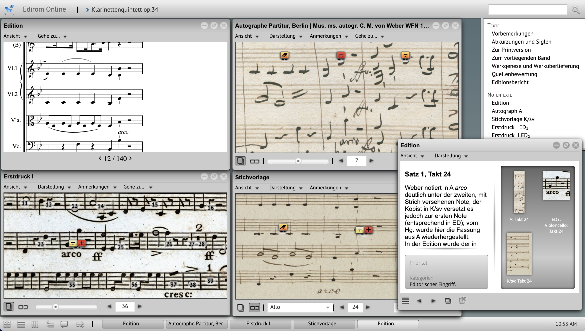
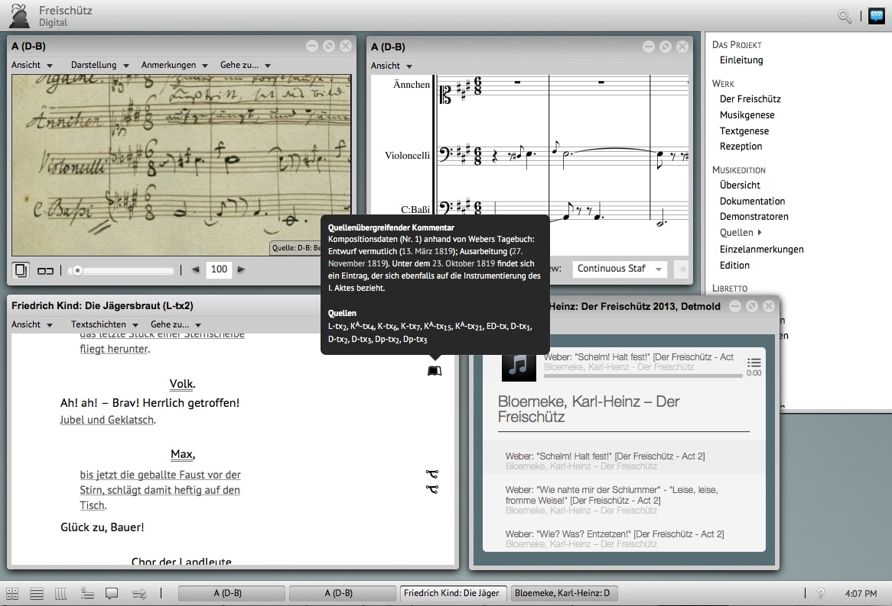
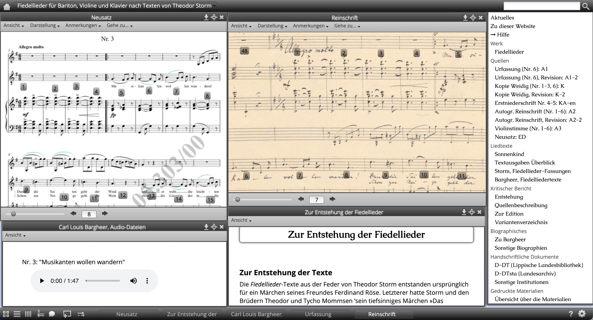

<div align="center">

[](https://github.com/Edirom/Edirom-Online/actions/workflows/pre-release.yml) 
[](https://nfdi4culture.de/id/E3648) 
[](CODE_OF_CONDUCT.md)
[](https://github.com/Edirom/Edirom-Online/releases) 
[](https://fairsoftwarechecklist.net/v0.2?f=31&a=32113&i=32300&r=133) 
[](https://bestpractices.coreinfrastructure.org/projects//9746)
[](https://fair-software.eu)
[](https://doi.org/10.5281/zenodo.5347861)

</div>


<div align="center"> 
 
**[Installation](#installation) •
[Further documentation](#further-documentation) •
[About](#about-edirom-online) • 
[Showcases](#showcases) •
[Dependencies](#dependencies) • 
[Roadmap](#roadmap) • 
[Contributing](#contributing) • 
[Get in touch](#get-in-touch) • 
[Code of Conduct](#code-of-conduct) • 
[Citation](#citation) • 
[License](#license)**

</div>

# Edirom-Online

## Get started

Edirom-Online is a software for the **presentation and analysis of critical musical editions**. It is developed as a web application consisting of a [backend module](https://github.com/Edirom/Edirom-Online-Backend.git) (written in XQuery and deployed in [eXist-db]) and a [frontend module](https://github.com/Edirom/Edirom-Online-Frontend.git) (written in JavaScript and delpoyed in [nginx]). The backend/frontend modularization was introduced in April 2025 and led to a different setup routine. Further conceptual information can be found below, e.g. in the sections [About](#about-edirom-online) and [Showcases](#showcases).

The present repository contains configuration for building the Edirom-Online environment with Docker.

### Installation

Prerequisites: [Docker Desktop](https://www.docker.com/products/docker-desktop/) has to be installed.

**Step 1**: On your computer create and navigate to a directory for the Edirom-Online. 
Then open the command line of your computer (also known as Shell, PowerShell, Terminal) and clone the Edirom-Online Git repository to your machine with:

```bash
git clone https://github.com/Edirom/Edirom-Online.git
```

**Step 2**: In the command line change into the directory of the cloned repository and start the Edirom-Online (starting all components can take several minutes):

```bash
cd Edirom-Online
docker compose up
```

**Step 3 (optional)**: By default the docker-compose.yml configuration fetches the backend from https://github.com/Edirom/Edirom-Online-Backend.git (branch *develop*) and the frontend from https://github.com/Edirom/Edirom-Online-Frontend.git (branch *develop*). 
You can change this by setting variables before starting the docker compose in the command line, e.g.

```bash
export BE_REPO=https://github.com/YOUR-FORK-OF/Edirom-Online-Backend.git
export BE_BRANCH=cool-feature-branch
export FE_REPO=https://github.com/YOUR-FORK-OF/Edirom-Online-Frontend.git
export BE_BRANCH=awesome-feature-branch
docker compose up
```

If you have set a variable you can also unset it again (to fall back to the defaults) and you can view the altered configuration via 

```bash
unset BE_REPO
docker compose config
```

**Step 4**: To add data to the Edirom-Online a so-called xar (extensible archive format) package has to be uploaded into the eXist-db. 
If you do not have a xar package of an edition yet, you can take the following steps to upload the available example edition to the Edirom-Online.
If you have a xar file of an edition at hand go to step (b).

(a) build **xar of sample data** for deploying at exist-db
  * see [building sample data]

(b) upload the xar file to the Edirom-Online backend
  * at [http://localhost:8080/exist/apps/dashboard/admin#](http://localhost:8080/exist/apps/dashboard/admin#) (sign with password "changeme") 
  * go to "User Manager" and to the account "admin" and change the default password to a safer password, note it at a secure place
  * go to "Package Manager" then "Upload" and select the xar file which (supposed the build-method linked above was used) was built at `/PATH_TO_LOCAL_EDIROM_EDITION_EXAMPLE_REPO/build/EditionExample-0.1.xar`

For testing purposes you can also deploy multiple editions into one Edirom-Online by using the same steps to build and deploy another xar package.

**Step 5**: After the environment has been setup the Edirom-Online is available at:

[http://localhost:8089/](http://localhost:8089/)


### Further Documentation

Some useful information regarding documentation is captured in the [docs] folder of this repo. It contains:
* [Customize] Edirom-Online and content
* [Release Workflow] for the Edirom-Online
* [Manual setup] on a local machine
* [Data creation workflow] for the Edirom-Online


## About Edirom-Online

Edirom-Online is a software for the **presentation and analysis of critical musical editions** in a digital format, particularly in the fields of musicology and philology. Edirom-Online supports various data formats commonly used in digital humanities, such as [TEI] (Text Encoding Initiative) for textual data and [MEI] (Music Encoding Initiative) for musical data, that is visualized with [Verovio]. This allows for the integration of different data formats, starting in the early days with texts, images and music and adding audio and even film within a single edition.  
The Edirom idea was born in 2004 at [Musikwissenschaftliches Seminar Detmold/Paderborn] and even after several years of Edirom development, the success of Edirom based on the same core concepts as in the beginning continues with numerous projects using and developing Edirom tools and creating digital musical editions with this software. Edirom tools were originally developed by the project [Entwicklung von Werkzeugen für digitale Formen wissenschaftlich-kritischer Musikeditionen] (2006–2012) funded by the DFG. The development of Edirom is now maintained as a community effort while being strongly supported and accompanied by [Virtueller Forschungsverbund Edirom] (ViFE), primarily based at [Paderborn University]. ViFE aims to provide tools for scholars working with digital texts and music, especially those involved in editing historical documents.

### Showcases

To get some practical insights, look at these projects and editions that already use Edirom-Online.

**Clarinet quintet op.34 by Weber**

The third version of Webers clarinet quintet op.34 was created 2022 by Virtueller Forschungsverbund Edirom (ViFE) honoring Prof. Dr. Joachim Veit on the occasion of his retirement. The edition includes digital facsimiles, music that is encoded in MEI and visualized with [Verovio], annotations and texts.
  * publication of [Webers clarinet quintet]
  * code of Edirom-Online Release [v1.0.0-beta.4 (Emeritus)]
  * data of [clarinet quintet: Edition]
  
  

**Freischütz Digital**

The digital edition of Webers Freischütz was developed by the project "[Freischütz Digital] – Paradigmatische Umsetzung eines genuin digitalen Editionskonzepts" (BMBF, 2012–2015). Several demonstrators were developed and integrated into the Edirom-Online, e.g. 'Dynamic Score Rendering' and 'Genetic Text Stages'.
  * publication of [Webers Freischütz]
  * code of [Freischütz: Edirom-Online]



**Bargheer: Fiedellieder plus**

"Carl Louis Bargheer: Fiedellieder plus - Eine digitale Edition" was created 2013 as a students project at Musikwissenschaftliches Seminar Detmold/Paderborn with an early version of Edirom-Online.
  * publication of [Bargheers Fiedellieder]
  * code of [Bargheer: Edirom-Online]
  * data of [Bargheer: Edition]

  
 

## Dependencies

Edirom-Online depends heavily on the JavaScript framework [Ext JS] which is included in parts in our code base. We use Ext JS 4.2.1 in the GPL version. Edirom-Online also includes the [Raphaël] javascript library (MIT License) and the [ACE] editor (BSD license).

For running the tests provided in the [ANT build file] we rely on `xmllint` 
and `SaxonHE`. 
On a Debian based Linux system these can be installed with `apt-get install 
libsaxonhe-java libxml2-utils`. 
If SaxonHE is not available from your classpath by default you might need to 
explicitly point ANT at it by providing the `-lib` parameter, e.g. `ant -lib 
/usr/share/java/ run-all-tests`. 


## Roadmap

Until today Edirom-Online and its features were developed as one application with strong dependencies on the JavaScript framework [Ext JS] (current version Ext JS 4.2.1) like mentioned above. Frontend and backend are currently living in this one application. Regarding to Edirom-Onlines release plans ExtJS is planned to be updated in the near future until ExtJS 7.0.0.
With the help and under the guidance of the project "[Edirom-Online Reloaded]" (funded by the DFG, 2024–2026) Edirom will exprerience some major updates and improvements to achieve sustainability of the software, e.g features and functionalites will be modularized as [edirom web components] and also a separation of frontend and backend and a crucial reduction of dependencies especially regarding frameworks is envisaged. In addition [ZenMEM] will continue to support and coordinate the sustainable development of the Edirom-Online software.
See the [Edirom-Online milestones] for more details.


## Contributing

After all this information, you decided to contribute to Edirom-Online, that is awesome! We prepared a [CONTRIBUTING] file to help start your Edirom-Aventure now.

If you encounter a security issue in the code, please see the [Security Policy](.github/SECURITY.md) for further guidance.


## Get in touch

Even if you are not ready (yet) to contribute to this wonderful project, maybe instead you just have a question or want to get to know the people involved in the project a little better, here are some ideas for you: 
* The [Edirom mailing list] provides the option of self-subscription, we send invitations to the community meetings via this list and we have Edirom related discussions on this list
* In the [wiki] you can find information and meeting minutes of the edirom community meetings which are regularly on the first Wednesday of the month
* In [GitHub Discussions] you can start a discussion about any Edirom-Online related topic

## Code of Conduct

Please note that this project is released with a [Contributor Code of Conduct]. By participating in this project you agree to abide by its terms.

## Citation

Please cite the software/repository using the information provided under "Cite this repository" on the right hand side. The APA and BIBTeX citations are fed by information from the CITATION.cff file in this repository which you can also use as a source.
If you intend to cite unreleased branches or commits please use the commit hash in the citation. 

## License

Edirom-Online is released to the public under the terms of the [GNU GPL v.3] open source license.

[Musikwissenschaftliches Seminar Detmold/Paderborn]: https://www.muwi-detmold-paderborn.de/
[TEI]: https://tei-c.org/
[MEI]: https://music-encoding.org/
[Virtueller Forschungsverbund Edirom]: https://github.com/Edirom 
[Paderborn University]: https://www.uni-paderborn.de/en/
[Entwicklung von Werkzeugen für digitale Formen wissenschaftlich-kritischer Musikeditionen]: https://edirom.de/edirom-projekt/
[Webers clarinet quintet]: https://klarinettenquintett.weber-gesamtausgabe.de/
[v1.0.0-beta.4 (Emeritus)]: https://github.com/Edirom/Edirom-Online/releases/tag/v1.0.0-beta.4
[clarinet quintet: Edition]: https://git.uni-paderborn.de/wega/klarinettenquintett-edirom
[Freischütz digital]: https://freischuetz-digital.de/
[Webers Freischütz]: https://edition.freischuetz-digital.de/
[Freischütz: Edirom-Online]: https://github.com/Freischuetz-Digital/Edirom-Online
[Bargheers Fiedellieder]: https://bargheer.edirom.de/index.html
[Bargheer: Edirom-Online]: https://github.com/Edirom/Bargheer-EdiromOnline
[Bargheer: Edition]: https://github.com/Edirom/Bargheer-Edition
[eXist-db]: https://exist-db.org/
[nginx]: https://nginx.org/
[Verovio]: https://www.verovio.org/index.xhtml
[docs]: /docs
[Customize]: docs/customize.md
[Release Workflow]: docs/release-workflow.md
[Manual setup]: docs/setup.md
[Data creation workflow]: docs/data-creation-workflow.md
[Ext JS]: https://www.sencha.com/products/extjs
[Raphaël]: http://raphaeljs.com 
[ACE]: http://ace.ajax.org
[edirom web components]: https://github.com/Edirom/edirom-web-components-demonstrator
[Edirom-Online Reloaded]: https://www.uni-paderborn.de/projekt/1332
[Edirom-Online milestones]: https://github.com/Edirom/Edirom-Online/milestones
[ZenMEM]: https://www.uni-paderborn.de/zenmem
[CONTRIBUTING]: CONTRIBUTING.md
[Docker]: https://docs.docker.com/
[Docker Compose]: https://docs.docker.com/compose/
[building sample data]: https://github.com/Edirom/EditionExample?tab=readme-ov-file#building
[Edirom mailing list]: https://lists.uni-paderborn.de/mailman/listinfo/edirom-l
[wiki]: https://github.com/Edirom/Edirom-Online/wiki
[GitHub Discussions]: https://github.com/Edirom/Edirom-Online/discussions
[Contributor Code of Conduct]: CODE_OF_CONDUCT.md
[GNU GPL v.3]: http://www.gnu.org/copyleft/gpl.html
[ANT build file]: https://github.com/Edirom/Edirom-Online/blob/develop/build.xml

<!--
# EdiromOnline/app

This folder contains the javascript files for the application.

# EdiromOnline/resources

This folder contains static resources (typically an `"images"` folder as well).

# EdiromOnline/overrides

This folder contains override classes. All overrides in this folder will be 
automatically included in application builds if the target class of the override
is loaded.

# EdiromOnline/sass/etc

This folder contains misc. support code for sass builds (global functions, 
mixins, etc.)

# EdiromOnline/sass/src

This folder contains sass files defining css rules corresponding to classes
included in the application's javascript code build.  By default, files in this 
folder are mapped to the application's root namespace, 'EdiromOnline'. The
namespace to which files in this directory are matched is controlled by the
app.sass.namespace property in EdiromOnline/.sencha/app/sencha.cfg. 

# EdiromOnline/sass/var

This folder contains sass files defining sass variables corresponding to classes
included in the application's javascript code build.  By default, files in this 
folder are mapped to the application's root namespace, 'EdiromOnline'. The
namespace to which files in this directory are matched is controlled by the
app.sass.namespace property in EdiromOnline/.sencha/app/sencha.cfg. 
-->
