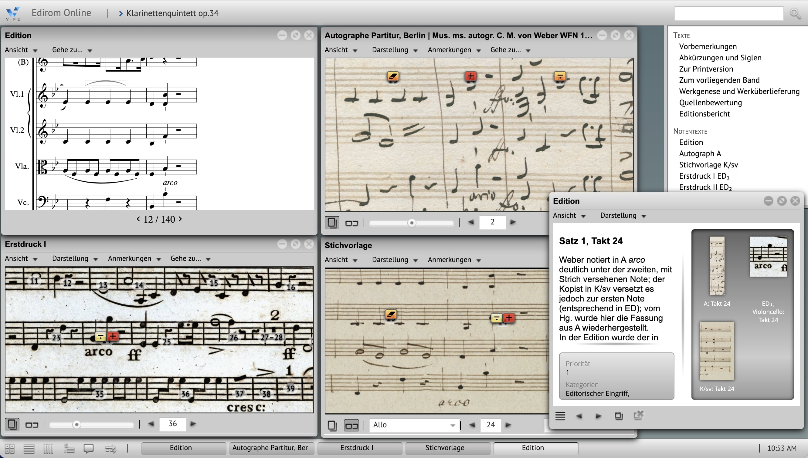
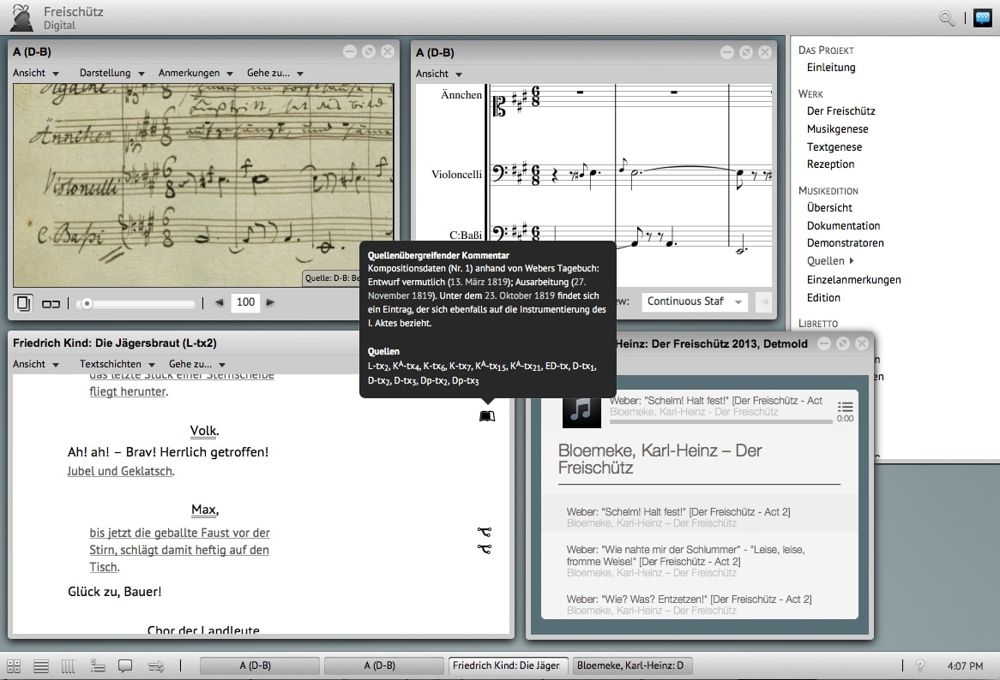
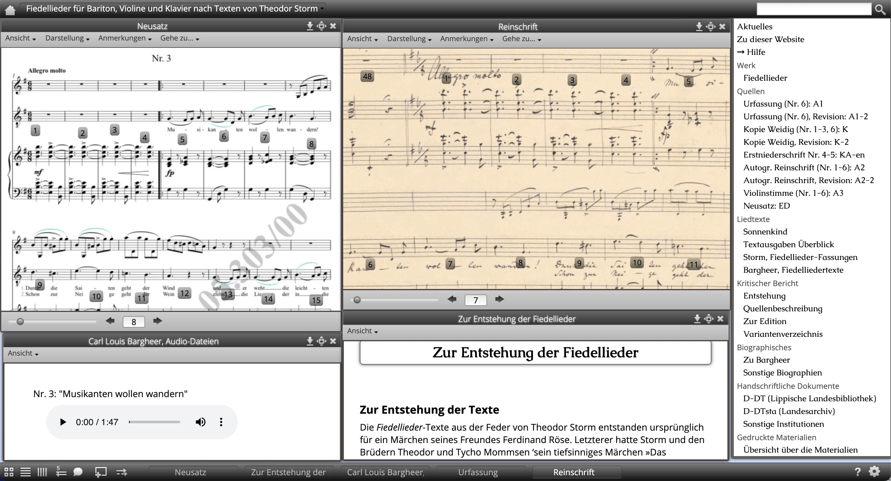

[](https://github.com/Edirom/Edirom-Online/actions/workflows/docker-ci.yml) [](https://nfdi4culture.de/id/E3648) [](CODE_OF_CONDUCT.md)

<div align="center">
 
**[Showcases](https://github.com/Edirom/Edirom-Online#-Showcases) •
[Get started](https://github.com/Edirom/Edirom-Online#-Get-started) • 
[Dependencies](https://github.com/Edirom/Edirom-Online#-Dependencies) • 
[Roadmap](https://github.com/Edirom/Edirom-Online#-Roadmap) • 
[Contributing](https://github.com/Edirom/Edirom-Online#-Contributing) • 
[Get in touch](https://github.com/Edirom/Edirom-Online#-Get-in-touch) • 
[Code of Conduct](https://github.com/Edirom/Edirom-Online#-Code-of-Conduct) • 
[License](https://github.com/Edirom/Edirom-Online#-License)**

</div>

# Edirom-Online

Edirom-Online is a software for the **presentation and analysis of critical musical editions** in a digital format, particularly in the fields of musicology and philology. Edirom-Online supports various data formats commonly used in digital humanities, such as [TEI] (Text Encoding Initiative) for textual data and [MEI] (Music Encoding Initiative) for musical data, that is visualized with [Verovio]. This allows for the integration of different data formats, starting in the early days with texts, images and music and adding audio and even film within a single edition.  
The Edirom idea was born in 2004 at [Musikwissenschaftliches Seminar Detmold/Paderborn] and even after several years of Edirom development, the success of Edirom based on the same core concepts as in the beginning continues with numerous projects using and developing Edirom tools and creating digital musical editions with this software. Edirom tools were originally developed by the project [Entwicklung von Werkzeugen für digitale Formen wissenschaftlich-kritischer Musikeditionen] (2006–2012) funded by the DFG. The development of Edirom is now maintained as a community effort while being strongly supported and accompanied by [Virtueller Forschungsverbund Edirom] (ViFE), primarily based at [Paderborn University]. ViFE aims to provide tools for scholars working with digital texts and music, especially those involved in editing historical documents.

## Showcases

To get some practical insights, look at these projects and editions that already use Edirom-Online.

**Clarinet quintet op.34 by Weber**

The third version of Webers clarinet quintet op.34 was created 2022 by Virtueller Forschungsverbund Edirom (ViFE) honoring Prof. Dr. Joachim Veit on the occasion of his retirement. The edition includes digital facsimiles, music that is encoded in MEI and visualized with , annotations and texts.
  * publication of [Webers clarinet quintet]
  
  

**Freischütz Digital**

The digital edition of Webers Freischütz was developed by the project "[Freischütz Digital] – Paradigmatische Umsetzung eines genuin digitalen Editionskonzepts" (BMBF, 2012–2015). Several demonstrators were developed and integrated into the Edirom-Online, e.g. 'Dynamic Score Rendering' and 'Genetic Text Stages'.
  * publication of [Webers Freischütz]
  * code of [Freischütz: Edirom-Online]



**Bargheer: Fiedellieder plus**

"Carl Louis Bargheer: Fiedellieder plus - Eine digitale Edition" was created 2013 as a students project at Musikwissenschaftliches Seminar Detmold/Paderborn with an early version of Edirom-Online.
  * publication of [Bargheers Fiedellieder]
  * code of [Bargheer: Edirom-Online]
  * data of [Bargheer: Edition]

  
 

## Get started

Edirom Online is a web application written in XQuery and JavaScript, and designed for deployment in [eXist-db].  
Please be aware, the software is still under high development and has to be seen as beta software.

### Cloning this repository

Since this repository uses submodules for e.g. fonts, it is necessary to clone the repository recursively.

```bash
git clone --recursive <project url>
```

If the submodules are not yet present after cloning, you can update them with:

```bash
git submodule update --init --recursive
```

### Building locally

For building Edirom Online you need *Sencha Cmd* installed on your system. You might want to refer to the [Sencha Cmd System Setup] section for more details.

Alternatively, we recommend to use a Docker container image for building, e.g. [bwbohl/sencha-cmd]

```bash
docker run --rm -it -v /ABSOLUTE/PATH/TO/YOUR/LOCAL/EDIROM-ONLINE/CLONE:/app --name ediBuild ghcr.io/bwbohl/sencha-cmd:latest
```

When you have your system prepared with all Sencha Cmd prerequisites or you have your docker container running you are now set up to execute the sencha build command. Do this by calling the build script included in this repository with one of the sencha build-type options (please refer to [sencha app build reference] for details), either in your native shell or in the container shell, e.g.:

```bash
./build.sh testing
```

### Starting an Edirom instance locally

* prepare **exist-db**
  * also see [exist-db via Docker]
  * `docker run -it -d -p 8080:8080 -p 8443:8443 --name exist stadlerpeter/existdb:6` (see stadlerpeter/existdb)
  * open in browser: `http://localhost:8080` (Note: there were problems opening this in Safari)
  * Login with "admin:[empty]"
* build and deploy **xar of Edirom**
  * also see [building Edirom locally] above
  * at `http://localhost:8080/exist/apps/dashboard/admin#` (signed-in) go to "Package Manager" then "Upload" and select the xar file which (supposed above build-method was used) was built at `/PATH_TO_LOCAL_EDIROM_REPO/build-xar/Edirom-Online-1.0.0-beta.5-[TIMESTAMP].xar`
* build **xar of sample data** for deploying at exist-db
  * also see [building sample data]
  * at `http://localhost:8080/exist/apps/dashboard/admin#` (signed-in) go to "Package Manager" then "Upload" and select the xar file which (supposed above build-method was used) was built at `/PATH_TO_LOCAL_EDIROM_EDITION_EXAMPLE_REPO/build/EditionExample-0.1.xar`
* in **eXist-db Package Manager** click on the "Edirom Online" entry - you will be directed to the running Edirom at `http://localhost:8080/exist/apps/Edirom-Online/index.html`

## Dependencies

Edirom Online depends heavily on the JavaScript framework [Ext JS] which is included in parts in our code base. We use Ext JS 4.2.1 in the GPL version. Edirom Online also includes the [Raphaël] javascript library (MIT License) and the [ACE] editor (BSD license).

## Roadmap

Until today Edirom-Online and its features were developed as one application with strong dependencies on the JavaScript framework [Ext JS] (current version Ext JS 4.2.1) like mentioned above. Frontend and backend are currently living in this one application. Regarding to Edirom-Onlines release plans ExtJS is planned to be updated in the near future until ExtJS 7.0.0.
With the help and under the guidance of the project "[Edirom-Online Reloaded]" (funded by the DFG, 2024–2026) Edirom will exprerience some major updates and improvements to achieve sustainability of the software, e.g features and functionalites will be modularized as [edirom web components] and also a separation of frontend and backend and a crucial reduction of dependencies especially regarding frameworks is envisaged. In addition [ZenMEM] will continue to support and coordinate the sustainable development of the Edirom-Online software.
See the [Edirom-Online milestones] for more details.

## Contributing

After all this information, you decided to contribute to Edirom-Online, that is awesome! We prepared a [CONTRIBUTING] file to help start your Edirom-Aventure now.

If you encounter a security issue in the code, please see the [Security Policy](.github/SECURITY.md) for further guidance.

## Get in touch

Even if you are not ready (yet) to contribute to this wonderful project, maybe instead you just have a question or want to get to know the people involved in the project a little better, here are some ideas for you: 
* there is an [Edirom mailinglist] with the option for selfsubscription
* the edirom community is meeting regularly every month at the first wednesday of a month, more information will be promoted via the mailinglist
* start a discussion at [GitHub Discussions]

## Code of Conduct

Please note that this project is released with a [Contributor Code of Conduct]. By participating in this project you agree to abide by its terms.

## License

Edirom Online is released to the public under the terms of the [GNU GPL v.3] open source license.

[Musikwissenschaftliches Seminar Detmold/Paderborn]: https://www.muwi-detmold-paderborn.de/
[TEI]: https://tei-c.org/
[MEI]: https://music-encoding.org/
[Virtueller Forschungsverbund Edirom]: https://github.com/Edirom 
[Paderborn University]: https://www.uni-paderborn.de/en/
[Entwicklung von Werkzeugen für digitale Formen wissenschaftlich-kritischer Musikeditionen]: https://edirom.de/edirom-projekt/
[Webers clarinet quintet]: https://klarinettenquintett.weber-gesamtausgabe.de/
[Freischütz digital]: https://freischuetz-digital.de/
[Webers Freischütz]: https://edition.freischuetz-digital.de/
[Freischütz: Edirom-Online]: https://github.com/Freischuetz-Digital/Edirom-Online
[Bargheers Fiedellieder]: https://bargheer.edirom.de/index.html
[Bargheer: Edirom-Online]: https://github.com/Edirom/Bargheer-EdiromOnline
[Bargheer: Edition]: https://github.com/Edirom/Bargheer-Edition
[eXist-db]: https://exist-db.org/
[Verovio]: https://www.verovio.org/index.xhtml
[Ext JS]: https://www.sencha.com/products/extjs
[Raphaël]: http://raphaeljs.com 
[ACE]: http://ace.ajax.org
[edirom web components]: https://github.com/Edirom/edirom-web-components-demonstrator
[Edirom-Online Reloaded]: https://www.uni-paderborn.de/projekt/1332
[Edirom-Online milestones]: https://github.com/Edirom/Edirom-Online/milestones
[ZenMEM]: https://www.uni-paderborn.de/zenmem
[CONTRIBUTING]: CONTRIBUTING.md
[Sencha Cmd System Setup]: https://docs.sencha.com/cmd/7.5.0/guides/intro_to_cmd.html#intro_to_cmd_-_system_setup
[bwbohl/sencha-cmd]: https://github.com/bwbohl/sencha-cmd/pkgs/container/sencha-cmd
[sencha app build reference]: https://docs.sencha.com/cmd/guides/advanced_cmd/cmd_reference.html#advanced_cmd-_-cmd_reference_-_sencha_app_build
[exist-db via Docker]: https://exist-db.org/exist/apps/doc/docker
[stadlerpeter/existdb]: https://hub.docker.com/r/stadlerpeter/existdb
[building Edirom locally]: https://github.com/Edirom/Edirom-Online?tab=readme-ov-file#building-locally
[building sample data]: https://github.com/Edirom/EditionExample?tab=readme-ov-file#building
[Edirom mailinglist]: https://lists.uni-paderborn.de/mailman/listinfo/edirom-l
[GitHub Discussions]: https://github.com/Edirom/Edirom-Online/discussions
[Contributor Code of Conduct]: CODE_OF_CONDUCT.md
[GNU GPL v.3]: http://www.gnu.org/copyleft/gpl.html


<!--
# EdiromOnline/app

This folder contains the javascript files for the application.

# EdiromOnline/resources

This folder contains static resources (typically an `"images"` folder as well).

# EdiromOnline/overrides

This folder contains override classes. All overrides in this folder will be 
automatically included in application builds if the target class of the override
is loaded.

# EdiromOnline/sass/etc

This folder contains misc. support code for sass builds (global functions, 
mixins, etc.)

# EdiromOnline/sass/src

This folder contains sass files defining css rules corresponding to classes
included in the application's javascript code build.  By default, files in this 
folder are mapped to the application's root namespace, 'EdiromOnline'. The
namespace to which files in this directory are matched is controlled by the
app.sass.namespace property in EdiromOnline/.sencha/app/sencha.cfg. 

# EdiromOnline/sass/var

This folder contains sass files defining sass variables corresponding to classes
included in the application's javascript code build.  By default, files in this 
folder are mapped to the application's root namespace, 'EdiromOnline'. The
namespace to which files in this directory are matched is controlled by the
app.sass.namespace property in EdiromOnline/.sencha/app/sencha.cfg. 
-->
